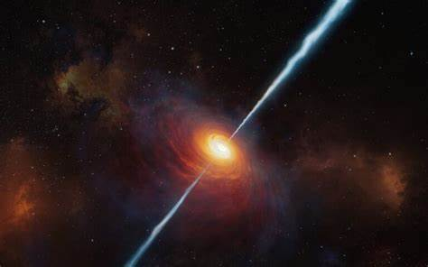

<center>
<h1> QuasarModel </h1>

<h3> Gaussian Model of VLBI- Source Images</h3>


</center>

## Description
This program takes images of sources (quasars) in the 
form of fits files and models them as elliptical gaussian
functions. The program can also take analytical gaussian 
functions as input, which is useful for testing. It also calculates the
fourier transform of the source using both fast fourier transform and the 
analytically calculated fourier transform. 

## Approach
The program starts out by making an initial guess about 
the number of sources in the image and their respective positions,
intensities, and distributions along a major and a minor axis.
The initial guess is made by searching the original image for
local maximas which gives positions and amplitudes for the gaussians.
For guessing the distributions along the major and minor axes the 
program also checks the intensities in the points right next to the 
local maximas. The rotation of the major and minor axes is initially set to
zero.

After making an initial guess, the program uses a least squares 
method to optimize the gaussian functions to better fit the data 
in the original image. In brief, the partial derivatives of the
gaussian functions are calculated and from that an adjustment 
is made. Because the least squares method wont to find a perfect
solution, the adjustment is only partly applied by a small "step".
The step-size is calculated by comparing the mean squared error (`chi_sq_dof`) 
in each point of the image after applying the adjustment at three different steps and using the
step that minimizes the theoretical parabola that can be fitted
through these points. The process of computing an adjustment with
the least squares method and applying the adjustment by some step is
iterated over until `chi_sq_dof` becomes as small as possible. 

After the first initial guess has been made and the gaussian
functions in that guess has been optimized, these gaussians are 
removed from the original images. A new guess is now made for the
residue (if there are one) and the subsequent new gaussians are then optimized in the
same way. The new optimized gaussians are then also removed from
the image and the program ones again tries to fit gaussians to the
residue. This process is repeated until there no longer are any
more local maximas (over a certain threshold) in
the image. The program then presents all the gaussians it has guessed
and optimized. 

## Downloading the Program
Downloading via pip is possible with 

```bash
pip install QuasarModel
```

and gives easy access to the special classes to build your own programs with. However, if you want to run the finished program with the gui or from the terminal it's better to download the github repository and then installing the requirements. 

```bash
git clone https://github.com/anzelius/QuasarModel.git
pip install -r QuasarModel/requirements.txt
```

## Running the Program
The program can run from an editor or from the terminal. When running the
program from an editor, run the `__main__.py` file with parameters. 

For full list of options see 
```bash
python quasarModel --help
```
Example: 
```bash
python quasarModel -r 1 
```
will run source 1 in `constants.py`. Assuming you are in the QuasarModel directory.

### GUI
A GUI for running the program exist. The GUI is built with PySimpleGUI. To run program with GUI use

```bash
python quasarModel
```
assuming you are in the QuasarModel directory. 

## Mathematical expressions from model output 
The model will calculate the following parameters: 
Amp, x<sub>0</sub>, y<sub>0</sub>, &#963;<sub>x</sub>, &#963;<sub>y</sub>, &#952;. 

Declare the following variables: 
<div style="color: #FFFFFF; padding: 10px; box-shadow: 1px 2px 3px 4px rgba(20,20,20,0.4)">
<center>
<em>x&#772; = x - x<sub>0</sub></em><br>
<em>y&#772; = y - y<sub>0</sub></em><br>
<em>a =  1 &divide; &#963;<sub>x</sub><sup>2</sup> </em><br>
<em>b =  1 &divide; &#963;<sub>y</sub><sup>2</sup> </em>
</center>
</div>

This gives 

<div style="color: #FFFFFF; padding: 10px; box-shadow: 1px 2px 3px 4px rgba(20,20,20,0.4)">
<center>
<em>a<sub>term</sub> = x&#772;<sup>2</sup> &middot; (1 + cos(2&#952;)) &divide; 2 + y&#772;<sup>2</sup> &middot; (1 - cos(2&#952;)) &divide; 2 + x&#772; &middot; y&#772; &middot; sin(2&#952;)</em><br>
<em>b<sub>term</sub> = x&#772;<sup>2</sup> &middot; (1 + cos(2&#952;)) &divide; 2 + y&#772;<sup>2</sup> &middot; (1 + cos(2&#952;)) &divide; 2 - x&#772; &middot; y&#772; &middot; sin(2&#952;)</em>
</center>
</div>

### Gaussian 
The expression for the gaussians based on the model output becomes
<div style="color: #FFFFFF; padding: 10px; box-shadow: 1px 2px 3px 4px rgba(20,20,20,0.4)">
<center>
<em>f (x, y) = Amp &middot; e<sup>-(a &middot; a<sub>term</sub> + b &middot; b<sub>term</sub>)</sup> </em>
</center>
</div>

### Analytical fourier transform  
The expression of the analytical fourier transform of the model gaussians based on the output becomes: 
<div style="color: #FFFFFF; padding: 10px; box-shadow: 1px 2px 3px 4px rgba(20,20,20,0.4)">
<center>
<em>FT (f (x, y)) = Amp &middot; &pi; &divide &radic;(a &middot; b) &middot; 
e<sup>-2&pi;i(x<sub>0</sub> &middot; x + y<sub>0</sub> &middot; y)</sup> &middot; 
e<sup> -&pi;<sup>2</sup> &middot; (y&middot;cos(&#952;)-x&middot; sin(&#952;))<sup>2</sup> &divide; b - 
&pi;<sup>2</sup>(x&middot;cos(&#952;) + y&middot;sin(&#952;))<sup>2</sup> &divide; a  </sup></em>
</center>
</div>

## Some Known Problems
&bull;  The model is not able to distinguish two peaks with the same amplitude, even if they are not overlapping.
This is not likely to happen when modelling real sources and has therefore not been a priority to fix. 

&bull;  When pressing "Stop" in the gui, an error message will appear. However, the gui is able to still run, and the 
modelling of the chosen source stops, so the purpose of the stop-button seems to fulfill its function anyways. 

&bull; The threshold_abs in source_model line 33 is used to filter out noise from data so that the model does not try to
model gaussians around noise peaks. However, this value might not be optimized for all different kinds of 
source data. 


